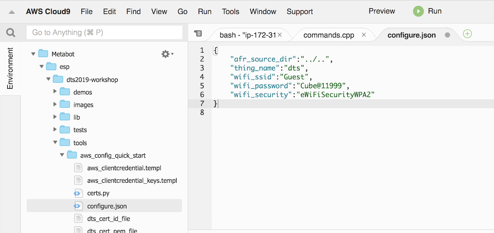
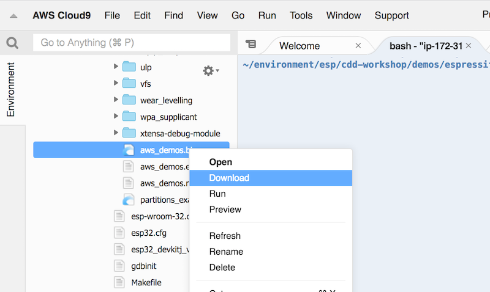

## Steps to compile Domain Tech Summit Workshop firmware for ESP32

1. Clone the repo:

```bash
git clone https://github.com/yona75/dts2019-workshop
```
2. Navigate to *~/environment/esp/dts2019-workshop/tools/aws_config_quick_start/ and open file configure.json*
Edit you *Thing name, WiFi credentials, and WiFi security* mode which should be *eWiFiSecurityWPA2*



3. Save the file

4. In the Terminal window navigate to *~/environment/esp/dts2019-workshop/tools/aws_config_quick_start* and execute *python SetupAWS.py setup* command to provision your *Thing, Certificate, and Policy*:

```bash
cd ~/environment/esp/dts2019-workshop/tools/aws_config_quick_start 
python SetupAWS.py setup
```

If successful command will not produce any output, but you can verify in AWS IoT Core Console that new Thing, Certificate and Policy were created.

5. In the Terminal window navigate to *~/environment/esp/dts2019-workshop/demos/espressif/esp32_devkitc_esp_wrover_kit/make* and execute *make menuconfig* command:

```bash
cd ~/environment/esp/dts2019-workshop/demos/espressif/esp32_devkitc_esp_wrover_kit/make 
make menuconfig
```

6. Click *Save* and then *Exit*


7. Execute *make* command

```bash
make
```

10. Once compilation is done, download these 3 files to your local computer:
- *build/aws_demos.bin*
- *build/partitions_example.bin*
- *build/bootloader/bootloader.bin*



11. Flash the firmware and observe console output as described in [Uploading compiled firmware to ESP32 development board](./FlashingFW.md)

12. In the Terminal window navigate back to *~/environment/esp/dts2019-workshop* and execute *git checkut shadow-demo* command:

```bash
cd ~/environment/esp/dts2019-workshop 
git checkout shadow-demo
```

You are now in the shadow-demo branch

13. Navigate to *~/environment/esp/dts2019-workshop/demos/espressif/esp32_devkitc_esp_wrover_kit/make* and execute *make* command:

```bash
cd ~/environment/esp/dts2019-workshop/demos/espressif/esp32_devkitc_esp_wrover_kit/make 
make
```

14. Once compilation is done, delete old *aws_demos.bin, partitions_example.bin, and bootloader.bin* from **YOUR LAPTOP!!!** and download **again** these 3 files to your local computer (If you will not delete or move old files on Mac they will be downloaded as aws_demos (1).bin, etc.):

- *build/aws_demos.bin*
- *build/partitions_example.bin*
- *build/bootloader/bootloader.bin*

15. Flash the firmware and observe console output as described in [Uploading compiled firmware to ESP32 development board](./FlashingFW.md) section

16. In AWS Console navigate to AWS IoT Core -> Manage -> <YOUR THING> -> Shadow
  Observe the sensors output
  
17. Edit the *desired* section of the demo to set LED colors (Insert this BEFORE *reported* section)
```json
  "desired": {
    "leds": [
      {
        "red": 16,
        "green": 0,
        "blue": 0
      },
      {
        "red": 0,
        "green": 15,
        "blue": 0
      },
      {
        "red": 0,
        "green": 0,
        "blue": 15
      },
      {
        "red": 15,
        "green": 15,
        "blue": 0
      },
      {
        "red": 0,
        "green": 15,
        "blue": 15
      }
    ]
  },
  ```

